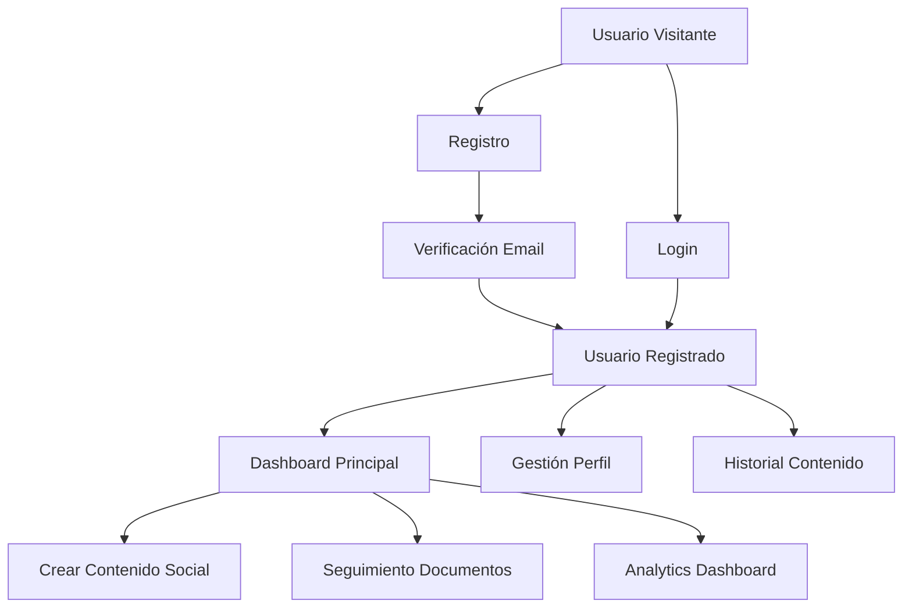
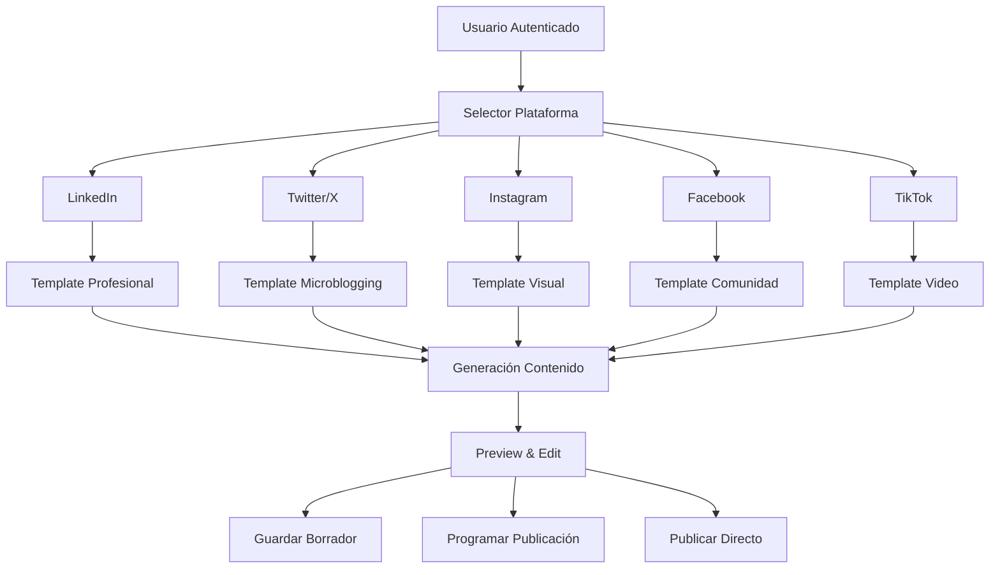
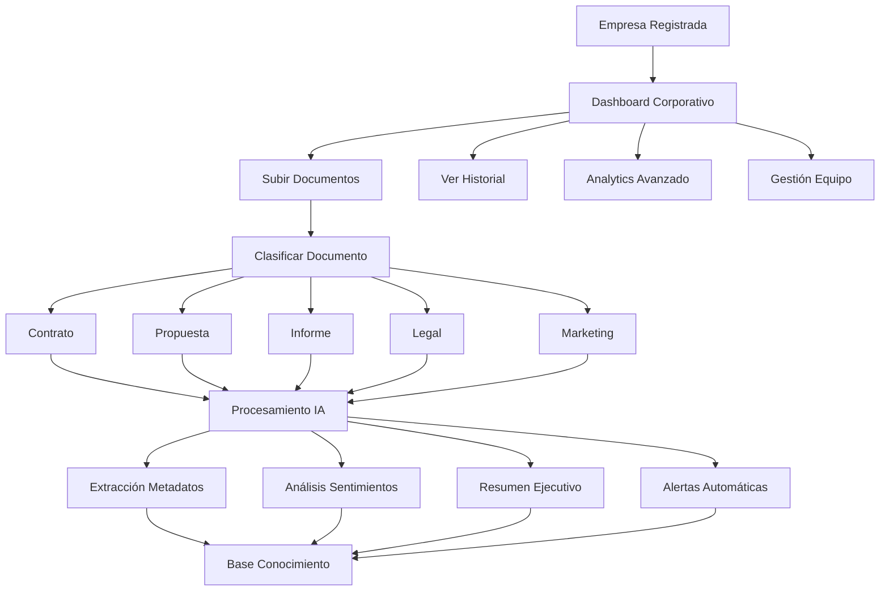
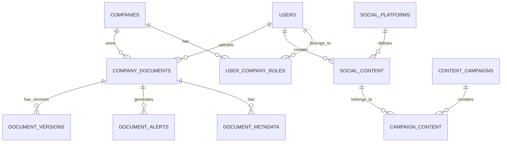

# 🗺️ Mapa Conceptual - Ampliación Solución Digital Content IA

## 📊 Análisis del Estado Actual vs Ampliación Propuesta

### 🔄 **EVOLUCIÓN ARQUITECTÓNICA**

```
ACTUAL (MVP)                    →    AMPLIACIÓN (ENTERPRISE)
─────────────────────────────        ─────────────────────────────
📱 Single User Interface            📱 Multi-User SaaS Platform
🔓 No Authentication               🔐 User Authentication & Authorization
💾 Local File Storage              🗄️ Robust Database Management
🎯 General Content Creation        🏢 Enterprise Document Tracking
📝 Mixed Content Generation        📱 Specialized Social Media Tools
```

---

## 🏗️ ARQUITECTURA PROPUESTA

### 1. 🔐 **SISTEMA DE AUTENTICACIÓN Y USUARIOS**

#### 📋 Casos de Uso (UML)


#### 🗄️ **Base de Datos - Tabla USERS**
```sql
-- Script: 001_create_users_table.sql
CREATE TABLE users (
    id UUID PRIMARY KEY DEFAULT gen_random_uuid(),
    email VARCHAR(255) UNIQUE NOT NULL,
    password_hash VARCHAR(255) NOT NULL,
    first_name VARCHAR(100) NOT NULL,
    last_name VARCHAR(100) NOT NULL,
    company_name VARCHAR(200),
    subscription_plan ENUM('free', 'pro', 'enterprise') DEFAULT 'free',
    created_at TIMESTAMP DEFAULT CURRENT_TIMESTAMP,
    updated_at TIMESTAMP DEFAULT CURRENT_TIMESTAMP,
    last_login TIMESTAMP,
    is_active BOOLEAN DEFAULT true,
    email_verified BOOLEAN DEFAULT false,
    verification_token VARCHAR(255),
    reset_token VARCHAR(255),
    reset_token_expires TIMESTAMP
);

-- Índices para optimización
CREATE INDEX idx_users_email ON users(email);
CREATE INDEX idx_users_company ON users(company_name);
CREATE INDEX idx_users_subscription ON users(subscription_plan);
```

#### 📄 **Scripts de Autenticación**
- `auth_manager.py` - Gestión de sesiones y JWT
- `password_utils.py` - Hashing y validación de contraseñas
- `email_service.py` - Verificación y recuperación por email
- `middleware_auth.py` - Middleware de autenticación para rutas

---

### 2. 📱 **MÓDULO ESPECIALIZADO - REDES SOCIALES**

#### 📋 Casos de Uso (UML)


#### 🗄️ **Base de Datos - SOCIAL MEDIA**
```sql
-- Script: 002_create_social_media_tables.sql

-- Tabla de plantillas por plataforma
CREATE TABLE social_platforms (
    id SERIAL PRIMARY KEY,
    name VARCHAR(50) NOT NULL UNIQUE,
    max_characters INTEGER,
    supports_images BOOLEAN DEFAULT false,
    supports_video BOOLEAN DEFAULT false,
    hashtag_limit INTEGER,
    template_prompt TEXT
);

-- Tabla de contenido generado
CREATE TABLE social_content (
    id UUID PRIMARY KEY DEFAULT gen_random_uuid(),
    user_id UUID REFERENCES users(id) ON DELETE CASCADE,
    platform_id INTEGER REFERENCES social_platforms(id),
    title VARCHAR(200),
    content TEXT NOT NULL,
    hashtags TEXT[],
    target_audience VARCHAR(200),
    language VARCHAR(5) DEFAULT 'es',
    tone ENUM('professional', 'casual', 'humorous', 'inspirational') DEFAULT 'professional',
    status ENUM('draft', 'scheduled', 'published', 'archived') DEFAULT 'draft',
    scheduled_at TIMESTAMP,
    published_at TIMESTAMP,
    created_at TIMESTAMP DEFAULT CURRENT_TIMESTAMP,
    updated_at TIMESTAMP DEFAULT CURRENT_TIMESTAMP,
    ai_model_used VARCHAR(100),
    engagement_metrics JSONB
);

-- Tabla de campañas de contenido
CREATE TABLE content_campaigns (
    id UUID PRIMARY KEY DEFAULT gen_random_uuid(),
    user_id UUID REFERENCES users(id) ON DELETE CASCADE,
    name VARCHAR(200) NOT NULL,
    description TEXT,
    start_date DATE,
    end_date DATE,
    status ENUM('planning', 'active', 'paused', 'completed') DEFAULT 'planning',
    created_at TIMESTAMP DEFAULT CURRENT_TIMESTAMP
);

-- Relación contenido-campañas
CREATE TABLE campaign_content (
    campaign_id UUID REFERENCES content_campaigns(id) ON DELETE CASCADE,
    content_id UUID REFERENCES social_content(id) ON DELETE CASCADE,
    PRIMARY KEY (campaign_id, content_id)
);
```

#### 📄 **Scripts del Módulo Social Media**
- `social_media_manager.py` - Controlador principal
- `platform_templates.py` - Templates específicos por plataforma
- `content_scheduler.py` - Sistema de programación
- `hashtag_analyzer.py` - Análisis y sugerencia de hashtags
- `engagement_tracker.py` - Métricas de engagement

---

### 3. 📊 **SISTEMA DE SEGUIMIENTO EMPRESARIAL**

#### 📋 Casos de Uso (UML)


#### 🗄️ **Base de Datos - SEGUIMIENTO EMPRESARIAL**
```sql
-- Script: 003_create_enterprise_tracking_tables.sql

-- Tabla de empresas/organizaciones
CREATE TABLE companies (
    id UUID PRIMARY KEY DEFAULT gen_random_uuid(),
    name VARCHAR(200) NOT NULL,
    industry VARCHAR(100),
    size ENUM('startup', 'small', 'medium', 'large', 'enterprise'),
    country VARCHAR(50),
    website VARCHAR(255),
    logo_url VARCHAR(500),
    subscription_tier ENUM('basic', 'professional', 'enterprise') DEFAULT 'basic',
    created_at TIMESTAMP DEFAULT CURRENT_TIMESTAMP,
    updated_at TIMESTAMP DEFAULT CURRENT_TIMESTAMP,
    is_active BOOLEAN DEFAULT true
);

-- Relación usuarios-empresas
CREATE TABLE user_company_roles (
    id UUID PRIMARY KEY DEFAULT gen_random_uuid(),
    user_id UUID REFERENCES users(id) ON DELETE CASCADE,
    company_id UUID REFERENCES companies(id) ON DELETE CASCADE,
    role ENUM('owner', 'admin', 'editor', 'viewer') DEFAULT 'viewer',
    created_at TIMESTAMP DEFAULT CURRENT_TIMESTAMP,
    UNIQUE(user_id, company_id)
);

-- Tabla de documentos empresariales
CREATE TABLE company_documents (
    id UUID PRIMARY KEY DEFAULT gen_random_uuid(),
    company_id UUID REFERENCES companies(id) ON DELETE CASCADE,
    uploaded_by UUID REFERENCES users(id),
    title VARCHAR(300) NOT NULL,
    description TEXT,
    file_path VARCHAR(500) NOT NULL,
    file_type VARCHAR(20) NOT NULL,
    file_size BIGINT,
    document_type ENUM('contract', 'proposal', 'report', 'legal', 'marketing', 'other'),
    status ENUM('processing', 'completed', 'error') DEFAULT 'processing',
    tags TEXT[],
    created_at TIMESTAMP DEFAULT CURRENT_TIMESTAMP,
    updated_at TIMESTAMP DEFAULT CURRENT_TIMESTAMP,
    processed_at TIMESTAMP,
    checksum VARCHAR(64) UNIQUE
);

-- Metadatos extraídos por IA
CREATE TABLE document_metadata (
    id UUID PRIMARY KEY DEFAULT gen_random_uuid(),
    document_id UUID REFERENCES company_documents(id) ON DELETE CASCADE,
    key_entities JSONB,
    sentiment_analysis JSONB,
    summary TEXT,
    important_dates DATE[],
    financial_figures JSONB,
    risks_identified TEXT[],
    action_items TEXT[],
    confidence_score DECIMAL(3,2),
    ai_model_used VARCHAR(100),
    extracted_at TIMESTAMP DEFAULT CURRENT_TIMESTAMP
);

-- Sistema de alertas
CREATE TABLE document_alerts (
    id UUID PRIMARY KEY DEFAULT gen_random_uuid(),
    document_id UUID REFERENCES company_documents(id) ON DELETE CASCADE,
    alert_type ENUM('deadline', 'risk', 'opportunity', 'compliance', 'other'),
    severity ENUM('low', 'medium', 'high', 'critical'),
    title VARCHAR(200) NOT NULL,
    description TEXT,
    due_date DATE,
    is_resolved BOOLEAN DEFAULT false,
    assigned_to UUID REFERENCES users(id),
    created_at TIMESTAMP DEFAULT CURRENT_TIMESTAMP,
    resolved_at TIMESTAMP
);

-- Historial de versiones de documentos
CREATE TABLE document_versions (
    id UUID PRIMARY KEY DEFAULT gen_random_uuid(),
    document_id UUID REFERENCES company_documents(id) ON DELETE CASCADE,
    version_number INTEGER NOT NULL,
    file_path VARCHAR(500) NOT NULL,
    changes_summary TEXT,
    uploaded_by UUID REFERENCES users(id),
    created_at TIMESTAMP DEFAULT CURRENT_TIMESTAMP
);
```

#### 📄 **Scripts del Sistema Empresarial**
- `enterprise_manager.py` - Controlador principal empresarial
- `document_processor.py` - Procesamiento automático de documentos
- `metadata_extractor.py` - Extracción de metadatos con IA
- `alert_system.py` - Sistema de alertas inteligentes
- `analytics_engine.py` - Motor de análisis empresarial
- `compliance_checker.py` - Verificación de cumplimiento
- `version_control.py` - Control de versiones de documentos

---

## 🗄️ ARQUITECTURA DE BASE DE DATOS

### 🔧 **Tecnología Propuesta: PostgreSQL + Redis**

#### **PostgreSQL** (Base de datos principal)
- ✅ ACID compliance para integridad de datos
- ✅ Soporte JSON/JSONB para metadatos flexibles
- ✅ Escalabilidad horizontal con particionado
- ✅ Full-text search integrado
- ✅ Extensiones AI (pgvector para embeddings)

#### **Redis** (Cache y sesiones)
- ✅ Cache de consultas frecuentes
- ✅ Gestión de sesiones de usuario
- ✅ Queue para procesamiento asíncrono
- ✅ Rate limiting para APIs

### 📊 **Diagrama de Relaciones (ERD)**


---

## 🏗️ ARQUITECTURA TÉCNICA PROPUESTA

### 📁 **Estructura de Directorio Ampliada**
```
ejemplo_Ollama_Enterprise/
├── app/
│   ├── main.py                    # App principal Streamlit
│   ├── config/
│   │   ├── settings.py            # Configuración general
│   │   ├── database.py            # Configuración BD
│   │   └── redis_config.py        # Configuración Redis
│   ├── auth/
│   │   ├── __init__.py
│   │   ├── auth_manager.py        # Gestión autenticación
│   │   ├── password_utils.py      # Utilidades contraseñas
│   │   ├── email_service.py       # Servicio email
│   │   └── middleware_auth.py     # Middleware auth
│   ├── social_media/
│   │   ├── __init__.py
│   │   ├── social_manager.py      # Controlador principal
│   │   ├── platform_templates.py # Templates plataformas
│   │   ├── content_scheduler.py   # Programador contenido
│   │   ├── hashtag_analyzer.py    # Análisis hashtags
│   │   └── engagement_tracker.py  # Métricas engagement
│   ├── enterprise/
│   │   ├── __init__.py
│   │   ├── enterprise_manager.py  # Controlador empresarial
│   │   ├── document_processor.py  # Procesador documentos
│   │   ├── metadata_extractor.py  # Extractor metadatos
│   │   ├── alert_system.py        # Sistema alertas
│   │   ├── analytics_engine.py    # Motor análisis
│   │   ├── compliance_checker.py  # Verificador cumplimiento
│   │   └── version_control.py     # Control versiones
│   ├── database/
│   │   ├── __init__.py
│   │   ├── models.py              # Modelos SQLAlchemy
│   │   ├── migrations/            # Migraciones Alembic
│   │   └── seeds/                 # Datos iniciales
│   ├── api/
│   │   ├── __init__.py
│   │   ├── routes/
│   │   │   ├── auth_routes.py     # Rutas autenticación
│   │   │   ├── social_routes.py   # Rutas redes sociales
│   │   │   └── enterprise_routes.py # Rutas empresariales
│   │   └── middleware.py          # Middleware API
│   ├── utils/
│   │   ├── __init__.py
│   │   ├── ai_utils.py           # Utilidades IA (existente)
│   │   ├── file_utils.py         # Utilidades archivos
│   │   ├── validation.py         # Validaciones
│   │   └── security.py           # Utilidades seguridad
│   ├── static/
│   │   ├── css/
│   │   ├── js/
│   │   └── images/
│   └── templates/
│       ├── pages/                # Páginas Streamlit
│       └── emails/               # Templates email
├── scripts/
│   ├── database/
│   │   ├── 001_create_users_table.sql
│   │   ├── 002_create_social_media_tables.sql
│   │   ├── 003_create_enterprise_tracking_tables.sql
│   │   ├── 004_create_indexes.sql
│   │   └── 005_seed_data.sql
│   ├── deploy/
│   │   ├── docker-compose.prod.yml
│   │   ├── nginx.conf
│   │   └── ssl_setup.sh
│   └── maintenance/
│       ├── backup.py
│       ├── cleanup.py
│       └── migration.py
├── tests/
│   ├── unit/
│   ├── integration/
│   └── e2e/
├── docs/
│   ├── api/                      # Documentación API
│   ├── deployment/               # Guías despliegue
│   └── user_guide/              # Manual usuario
├── requirements/
│   ├── base.txt                 # Dependencias base
│   ├── production.txt           # Dependencias producción
│   └── development.txt          # Dependencias desarrollo
├── docker-compose.yml           # Docker para desarrollo
├── docker-compose.prod.yml      # Docker para producción
├── Dockerfile.app              # Container aplicación
├── Dockerfile.worker           # Container workers
├── nginx.conf                  # Configuración proxy
└── README.md                   # Documentación principal
```

---

## 🔧 STACK TECNOLÓGICO AMPLIADO

### 💾 **Backend**
- **FastAPI** - APIs REST de alto rendimiento
- **SQLAlchemy** - ORM para PostgreSQL
- **Alembic** - Migraciones de base de datos
- **Celery** - Procesamiento asíncrono
- **Redis** - Cache y message broker
- **Pydantic** - Validación de datos

### 🎨 **Frontend**
- **Streamlit** - Interfaz principal (mantener)
- **React** - Dashboard administrativo avanzado
- **Tailwind CSS** - Styling moderno
- **Chart.js** - Gráficos y visualizaciones

### 🗄️ **Base de Datos**
- **PostgreSQL 15+** - Base de datos principal
- **Redis 7+** - Cache y sesiones
- **MinIO** - Almacenamiento de archivos
- **pgvector** - Vectores para embeddings

### 🔐 **Seguridad**
- **JWT** - Tokens de autenticación
- **bcrypt** - Hashing de contraseñas
- **OAuth 2.0** - Integración con terceros
- **CORS** - Control de acceso
- **Rate Limiting** - Protección contra ataques

### 🚀 **DevOps & Deployment**
- **Docker & Docker Compose** - Containerización
- **Nginx** - Reverse proxy y load balancer
- **Certbot** - Certificados SSL automáticos
- **GitHub Actions** - CI/CD
- **Prometheus + Grafana** - Monitoring

---

## 📊 CASOS DE USO DETALLADOS

### 🔐 **Módulo de Autenticación**

#### **CU-001: Registro de Usuario**
```gherkin
Feature: Registro de Usuario
  Scenario: Usuario se registra exitosamente
    Given un usuario visita la página de registro
    When completa el formulario con datos válidos
    And hace clic en "Registrarse"
    Then se crea una cuenta nueva
    And se envía un email de verificación
    And se redirige al dashboard
```

#### **CU-002: Login de Usuario**
```gherkin
Feature: Login de Usuario
  Scenario: Usuario hace login exitosamente
    Given un usuario registrado
    When ingresa credenciales correctas
    Then se autentica exitosamente
    And se crea una sesión
    And se redirige al dashboard principal
```

### 📱 **Módulo de Redes Sociales**

#### **CU-003: Crear Contenido para LinkedIn**
```gherkin
Feature: Crear Contenido LinkedIn
  Scenario: Usuario crea post profesional
    Given un usuario autenticado
    When selecciona "LinkedIn" como plataforma
    And ingresa el tema del contenido
    And selecciona audiencia "Profesionales IT"
    And hace clic en "Generar"
    Then se crea contenido optimizado para LinkedIn
    And se muestra preview del post
    And se dan opciones de editar/guardar/programar
```

#### **CU-004: Programar Publicación**
```gherkin
Feature: Programar Publicación
  Scenario: Usuario programa contenido
    Given contenido creado y editado
    When selecciona "Programar publicación"
    And elige fecha y hora futura
    Then el contenido se guarda como programado
    And se agenda para publicación automática
```

### 🏢 **Módulo Empresarial**

#### **CU-005: Subir Documento Empresarial**
```gherkin
Feature: Subir Documento
  Scenario: Empresa sube contrato para análisis
    Given un usuario con rol de empresa
    When sube un archivo PDF de contrato
    And selecciona tipo "Contrato"
    And añade tags relevantes
    Then el documento se procesa automáticamente
    And se extraen metadatos importantes
    And se generan alertas si hay fechas críticas
```

#### **CU-006: Dashboard Analítico**
```gherkin
Feature: Dashboard Analítico
  Scenario: Usuario ve analytics de documentos
    Given una empresa con documentos procesados
    When accede al dashboard analítico
    Then ve métricas de documentos por tipo
    And alertas pendientes por resolverFuncionalidades
    And gráficos de tendencias temporales
    And resúmenes ejecutivos automáticos
```

---

## 🗃️ SCRIPTS DE BASE DE DATOS COMPLETOS

### 📄 **Script 004: Índices y Optimizaciones**
```sql
-- Script: 004_create_indexes.sql

-- Índices para optimización de consultas
CREATE INDEX CONCURRENTLY idx_social_content_user_platform 
ON social_content(user_id, platform_id);

CREATE INDEX CONCURRENTLY idx_social_content_status_scheduled 
ON social_content(status, scheduled_at) 
WHERE status = 'scheduled';

CREATE INDEX CONCURRENTLY idx_company_documents_company_type 
ON company_documents(company_id, document_type);

CREATE INDEX CONCURRENTLY idx_company_documents_created_at 
ON company_documents(created_at DESC);

CREATE INDEX CONCURRENTLY idx_document_alerts_severity_resolved 
ON document_alerts(severity, is_resolved) 
WHERE is_resolved = false;

-- Índices de texto completo
CREATE INDEX CONCURRENTLY idx_social_content_fulltext 
ON social_content USING gin(to_tsvector('spanish', content));

CREATE INDEX CONCURRENTLY idx_documents_fulltext 
ON company_documents USING gin(to_tsvector('spanish', title || ' ' || description));

-- Índices para JSON
CREATE INDEX CONCURRENTLY idx_metadata_entities 
ON document_metadata USING gin(key_entities);

CREATE INDEX CONCURRENTLY idx_metadata_sentiment 
ON document_metadata USING gin(sentiment_analysis);
```

### 📄 **Script 005: Datos Iniciales**
```sql
-- Script: 005_seed_data.sql

-- Plataformas de redes sociales
INSERT INTO social_platforms (name, max_characters, supports_images, supports_video, hashtag_limit, template_prompt) VALUES
('LinkedIn', 3000, true, true, 10, 'Crea contenido profesional y educativo para LinkedIn...'),
('Twitter', 280, true, true, 5, 'Crea contenido conciso y atractivo para Twitter...'),
('Instagram', 2200, true, true, 30, 'Crea contenido visual y aspiracional para Instagram...'),
('Facebook', 63206, true, true, 10, 'Crea contenido engaging para comunidades Facebook...'),
('TikTok', 2200, true, true, 5, 'Crea contenido viral y entretenido para TikTok...');

-- Configuraciones del sistema
INSERT INTO system_settings (key, value, description) VALUES
('max_file_size_mb', '50', 'Tamaño máximo de archivo en MB'),
('supported_languages', '["es", "en", "fr", "it", "de"]', 'Idiomas soportados'),
('ai_models_available', '["llama3", "gemma", "mistral"]', 'Modelos IA disponibles'),
('email_verification_required', 'true', 'Requerir verificación de email');
```

---

## 🚀 PLAN DE IMPLEMENTACIÓN

### 📅 **Fase 1: Fundación (Semanas 1-3)**
- ✅ Configuración de PostgreSQL y Redis
- ✅ Implementación sistema de autenticación básico
- ✅ Migración de código existente a nueva arquitectura
- ✅ Setup básico de Docker para desarrollo

### 📅 **Fase 2: Módulo Social Media (Semanas 4-6)**
- ✅ Desarrollo de templates especializados por plataforma
- ✅ Sistema de programación de contenido
- ✅ Dashboard para gestión de contenido social
- ✅ Integración con APIs de redes sociales (opcional)

### 📅 **Fase 3: Módulo Empresarial (Semanas 7-10)**
- ✅ Sistema de carga y procesamiento de documentos
- ✅ Extracción automática de metadatos con IA
- ✅ Dashboard analítico empresarial
- ✅ Sistema de alertas inteligentes

### 📅 **Fase 4: Optimización y Deploy (Semanas 11-12)**
- ✅ Testing exhaustivo (unit, integration, e2e)
- ✅ Optimización de performance
- ✅ Configuración para producción
- ✅ Documentación completa

---

## 🔍 CONSIDERACIONES DE SEGURIDAD

### 🛡️ **Autenticación y Autorización**
- ✅ JWT con refresh tokens
- ✅ Rate limiting por IP y usuario
- ✅ Validación de entrada en todos los endpoints
- ✅ Logs de seguridad comprehensivos

### 🔐 **Protección de Datos**
- ✅ Encriptación en tránsito (HTTPS/TLS)
- ✅ Encriptación en reposo (base de datos)
- ✅ Hashing seguro de contraseñas (bcrypt)
- ✅ Sanitización de uploads de archivos

### 📊 **Compliance y Auditoría**
- ✅ Logs de todas las acciones de usuario
- ✅ Trazabilidad de cambios en documentos
- ✅ Backup automático con retención
- ✅ Cumplimiento RGPD básico

---

## 📈 MÉTRICAS Y MONITOREO

### 📊 **KPIs del Sistema**
- **Usuarios activos diarios/mensuales**
- **Tiempo de respuesta promedio de IA**
- **Documentos procesados por día**
- **Tasa de conversión de registro**
- **Engagement en contenido social generado**

### 🔍 **Monitoreo Técnico**
- **Uptime del sistema**
- **Uso de recursos (CPU, RAM, Disco)**
- **Latencia de base de datos**
- **Errores de aplicación**
- **Throughput de APIs**

---

## 💰 MODELO DE NEGOCIO SUGERIDO

### 📋 **Planes de Suscripción**

#### **🆓 Plan Gratuito**
- 10 generaciones de contenido/mes
- 1 empresa registrada
- 100MB almacenamiento documentos
- Soporte email

#### **💼 Plan Profesional ($29/mes)**
- 500 generaciones de contenido/mes
- 3 empresas registradas
- 5GB almacenamiento documentos
- Programación de contenido
- Analytics básico
- Soporte prioritario

#### **🏢 Plan Enterprise ($99/mes)**
- Generaciones ilimitadas
- Empresas ilimitadas
- 50GB almacenamiento documentos
- API access
- Analytics avanzado
- Alertas personalizadas
- Soporte dedicado
- White-label options

---

## 🎯 CONCLUSIONES Y RECOMENDACIONES

### ✅ **Beneficios de la Ampliación**
1. **💰 Monetización**: Modelo SaaS escalable
2. **👥 Multi-tenant**: Soporte para múltiples empresas
3. **🎯 Especialización**: Herramientas específicas por caso de uso
4. **📊 Inteligencia**: Analytics y seguimiento automatizado
5. **🔒 Seguridad**: Nivel empresarial con compliance

### 🚀 **Próximos Pasos Recomendados**
1. **Validación MVP**: Testing con usuarios beta
2. **Setup Infraestructura**: PostgreSQL + Redis en cloud
3. **Desarrollo Iterativo**: Implementar por fases
4. **Testing Continuo**: QA en cada entrega
5. **Go-to-Market**: Estrategia de lanzamiento B2B

---

**📅 Documento creado:** Julio 2025  
**👨‍💻 Arquitecto:** GitHub Copilot  
**🎯 Objetivo:** Ampliación Enterprise de Digital Content IA  
**📊 Complejidad:** Alta - Estimación 12 semanas desarrollo  
**💰 ROI Estimado:** 6-12 meses para break-even con Plan Enterprise  

---

*Este mapa conceptual proporciona la arquitectura completa para evolucionar de un MVP a una solución empresarial robusta, manteniendo la esencia de IA local mientras se añade valor empresarial significativo.*
